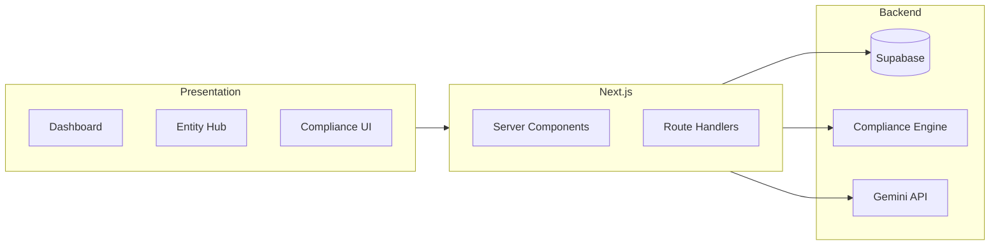

# Hopae Entity Management — Agent Architecture & System Report

**Assignment context.** Hopae connects to national eID providers worldwide; most require a locally incorporated entity to hold a production key, and keys cannot be shared. Some customers need a dedicated entity that Hopae sets up and manages. Every new country, provider, or customer can mean a new legal entity. Today Hopae has entities across 9+ countries and will manage 60+ across 20+ jurisdictions within 24 months. Each entity needs incorporation, banking, directors, compliance filings, and intercompany agreements with Luxembourg HQ. Compliance varies by country (annual filings, tax deadlines, registered agent renewals); missing a deadline can mean fines or dissolution. Currently, entity data, legal correspondence, compliance deadlines, and documents are scattered across inboxes, Notion, Google Drive, and tribal knowledge. The assignment: design AI workflows, automations, and policies (e.g. tools that connect AI agents to workplace tools) so routine ops scales to about **1 hour of human oversight per week**. This project was built under a 5-hour cap with dummy data; what we build and what we chose not to build are both part of the evaluation.

**System and agent architecture.** The system is built as a single Next.js application with one source of truth (Supabase Postgres) and two automation layers: a **deterministic compliance engine** and an **AI pipeline** (Gemini). There are no multi-agent frameworks; “agent” here means automated workflows and AI-assisted steps that reduce human effort.

- **Single source of truth:** Next.js App Router + Supabase store entities, jurisdictions, directors, compliance requirements, documents, and intercompany agreements. All reads are server-side (Server Components or Route Handlers).

- **Compliance engine (pure TypeScript, no LLM):** In `src/lib/compliance-engine/`: a **deadline calculator** (jurisdiction rules + incorporation date → due dates), a **risk scorer** (entity → overdue / due-soon / compliant / at-risk), and an **alert aggregator** (ranked list of entities needing attention). The engine has no database dependency; it is called from Server Components and Route Handlers with entity and jurisdiction data. This automates “what is due when” and “who needs attention first.”

- **AI pipeline (Gemini):** Three server-side Route Handlers only; the API key is never exposed to the client. **`/api/ai/draft`** — entity-grounded drafting of compliance filings and intercompany agreements (streaming). **`/api/ai/extract`** — extract parties, key dates, obligations, and governing law from document text. **`/api/ai/briefing`** — natural-language compliance summary for the dashboard. All use Gemini 2.5 Flash with template fallbacks when the key is missing.

- **Workflows:** *Document flow:* draft (AI or manual) → AI extraction (optional) → signature routing (status: draft → sent_for_signature → signed). *Compliance flow:* engine computes deadlines and risk → dashboard, calendar, and alert UI surface only what needs human attention.

**Prioritization.** Built: entity registry and detail (directors, banking, hierarchy, agreements), compliance engine and UI (calendar, risk dashboard, alerts), portfolio dashboard with jurisdiction heatmap and urgent action items, AI drafting and extraction, signature routing (demo), and Notion/Drive-style integration panels (demo). Not built: real e-filing, multi-tenant SaaS, RBAC, real e-signatures, mobile — to stay within the 5-hour cap and maximize impact on the 3-minute demo path (centralized data, automated deadlines and risk, AI-assisted drafting and summarization).

**How this reaches ~1 hour oversight.** Automation handles the routine: deadlines and risk are computed; alerts are ranked; drafting and extraction are AI-assisted; the briefing is AI-generated. Humans review alerts, approve or send drafts, sign documents, and handle exceptions. Centralized data and clear risk signals remove the need to hunt across inboxes and Notion, so a lean ops team can manage 60+ entities with about 1 hour of oversight per week.
